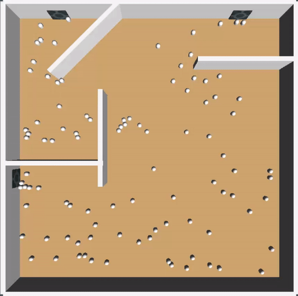
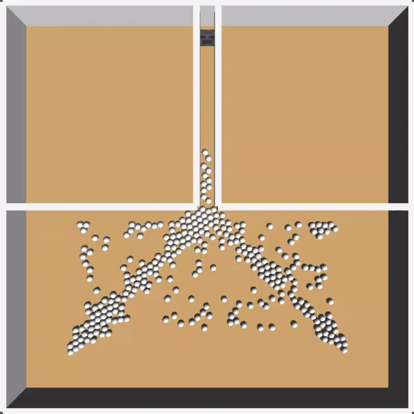

# unityEvacSimulation
[This project is supposed to be archive since 2013] simple evacuation simulation by unity

## Propose
I did this simulation for the "research" subject on the thrid year of my undergrad. In fact, I didn't understand about research in computer science style on that moment so, I just choosed the topic about whatever i think computer can do for answer my question. I just curious that what would happen if people need to immediately evacuate from the biulding. I then implemented the idea by Unity in which able to simulate basic physical property. In this case, I assumed that all people in my simulation are same. Thay all have equal size speed and force. They all move to the nearest door and none fall during the event. I evaluate this simulation by scene2, make people move toward a narrow path then check rate of flow. The result depict in scene1 and scene3. 

## To check it
Unity is needed for run simulations. To check it, clone this repository then seek /Assets/simulation1-4.unity. To change the environment, just manipulate wall object. To change amount of people, look for main camera then "main script" section.

scene1  
 
scene2 (for simulation evaluation) 
 
scene3 (for answer my question) 

